**Yahoo! Music Rating Recommendation**

**Section 1**

**Data Description:**

In this project we used an existing dataset from Yahoo Music's streaming platform in which there are over 717 million ratings of 136 thousand songs from 1.8 million users of the service.

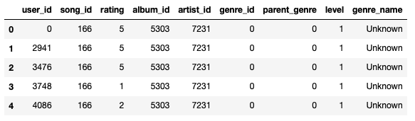

The features included are the anonymized user ids, song ids, album ids, and leveled genre information. The genre id is the primary genre associated with the song and parent genre is a broader genre that encompasses the primary one. If a parent genre exists, the level of the song changes from 1 to 2 given the hierarchy of genres. Additionally, some songs are of level 3 where the primary genre is the child of a genre that also has a parent genre. The hierarchy of these genres can be seen here:

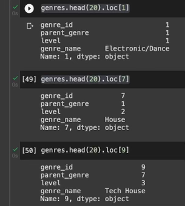

**Summary Statistics:**

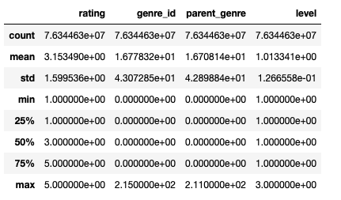

Given that the average rating is a bit higher than 3, maybe there are more highly rated songs in this data giving it a slight skew. The genre columns seem to have a max of around 215 meaning there are over 200 genres to choose from however the average genre number seems to be closer to 16. The standard deviation is also very high indicating there is a large variance in the genre selection of the songs rated. The level column has a max of 3 indicating that there are 3 different levels assigned to every song but the first 3 quartiles fall into the 1 bucket, indicating that the majority of songs are in the first level.

**EDA:**

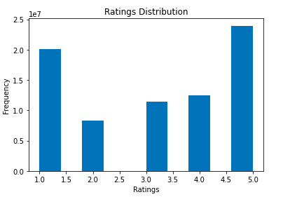

The distribution of ratings given by users in this dataset are fairly varied with similar counts in the 2-4 range and peaks at 1 and 4, showing that users tend to rate songs either very poorly or highly. This indicates that a good default metric for our model if that user has not rated a song yet, would be to give either a 1 or 5 depending on whether that user tends to rate more songs poorly or highly.

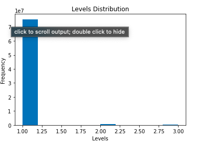

The distribution of level is a tri modal distribution with a comparatively higher peak at level 1. This shows that most songs are attached to a single genre (probably niche) and there are only a few songs with parent genres in the level 2 and 3 hierarchies. This indicates that the feature to use in our model should be genre\_id instead of parent\_genre if many songs don't have a parent genre

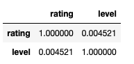 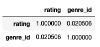

There are no significant correlations between the user ratings and genre information or the hierarchy levels. Therefore, the model will have to rely on historical data per user or similarity functions between users and songs to accurately predict ratings.

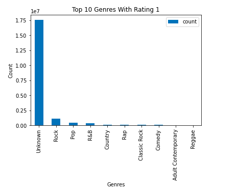 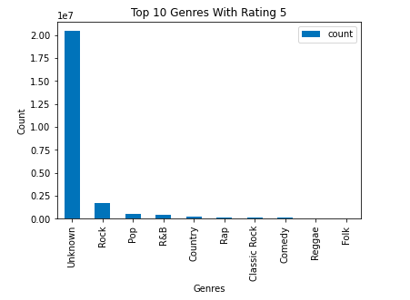

After some analysis on ratings across different genres, the data shows that the bigger genres like Pop and Rock which have a higher number of overall ratings, are also ranked with the most number of 5 and 1 ratings as well. This shows that because of the distribution of ratings across genres being unequal, knowing the genre does not indicate whether it will be more likely to get ranked higher or not. This also further affirms the close to 0 correlation coefficient between genre and rating.

**Section 2**

Given our dataset, a logical choice of predictive task would be to create a model that predicts what rating a user will give to a particular song. We could then use this model to predict the rating of songs the user hasn't seen, and create a recommender system that finds unheard songs that a particular user is likely to rate highly. From our EDA of the data above, we know that genre does not play a major role in determining the rating of a song. We can create a model that uses only song\_id and user\_id to learn from the data and create rating predictions.

When choosing a baseline for our model, we considered the following approaches:

One method, an unsupervised learning model, is a similarity based approach that allows us to use our items and users to learn what a user likes based on their previous ratings and the previous ratings of similar users. Using this framework we could create a model based on the following:

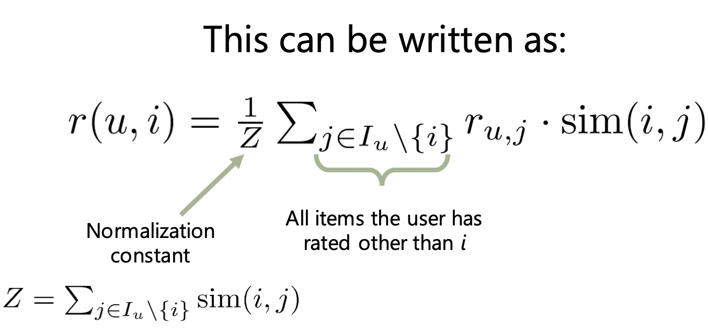

We can also make use of the ratings we do have in the dataset, by taking a supervised learning approach.

An example of this is the latent factor model:

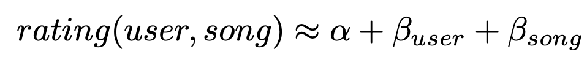

This model allows us to use the user and songs latent factors to come up with personalized modifiers to add to the optimized typical rating of the song. These personalized modifiers are defined as Beta(u), the amount this user tends to rank above the mean, and Beta(s), the amount this song tends to rank compared to other songs.

For example, if a song s is rated with an fitted mean (alpha) of 4.2, user u tends to rank -0.1 below the mean, and the song is ranked -0.1 compared to other songs, the predicted rating of u, s would be 4.2 - 0.2 - 0.1 = 3.9

For our baseline, we decided to use this simple latent factor rating predictor.

The first step in assessing the validity of our final model is to make sure we have ample training and testing data. Luckily, the dataset is already split into training and testing datasets. The training set has over 76 million entries, while the test set has over 2 million, providing us with more than enough unseen data to assess the validity of our model. Since the actual value of MSE isn't enough to show how good our model is as it is dependent on the predictor values, we looked to see how the MSE changed with the training and validation datasets. Using the validation MSE as a baseline for our results, we can compare our MSE from the latent factor approach with the MSE from our final model in order to assess its true effectiveness.

**Section 3**

In this project we attempt to tackle another supervised learning approach, making use of the Tensorflow recommender system library to create a deep learning recommender model to assess the effectiveness of deep learning in recommender systems.

The tensorflow recommender system framework uses what they call a two tower model, utilizing a neural network containing two models that learn representations separately for songs and users:

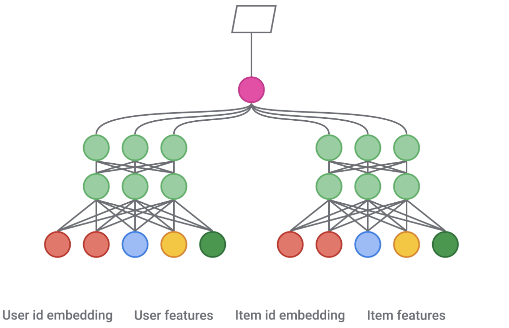

This system utilizes a "deep cross neural network", that takes an input layer, a cross network(that models explicit feature interactions) and a deep network(that models implicit feature interactions)

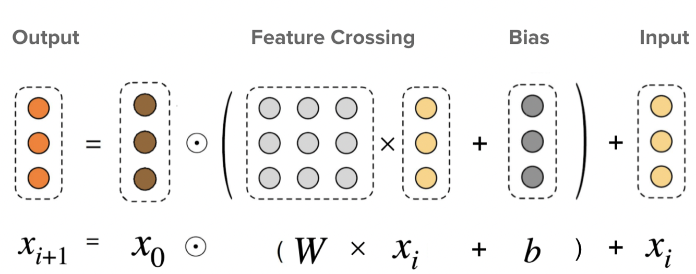

By learning from both explicit and implicit feature interactions, this choice of model attempts to solve the _cold start_ problem, which dictates that feature based models are not as useful when we have large amounts of data on a user/song, but are useful for unseen users and songs.

The song rating training set we are using has over 76 million entries. As a result, fitting a model on this dataset is a time consuming, and computationally expensive process. Continuously fitting models with different parameters and activation layers would be next to impossible on a dataset of this size. As a result, we decided to construct all preliminary models using a test/train split of only the given testing set(containing 2 million entries). Saving the full training set for the final model after parameter selection.

After converting our relevant data into tensors, we begin to create a vocabulary set for song\_ids and user\_ids, generating only the unique song and user ids in the training set:

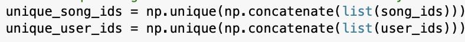

Our two tower model will consist of the following components:

1. A user tower, that generates user embeddings(high dimensional vector representations)
2. A song tower, that generates song embeddings
3. A loss function that maximizes the predicted user-song affinity for listens we observed, and minimizes it for listens that did not happen

This model can be implemented using the following code:

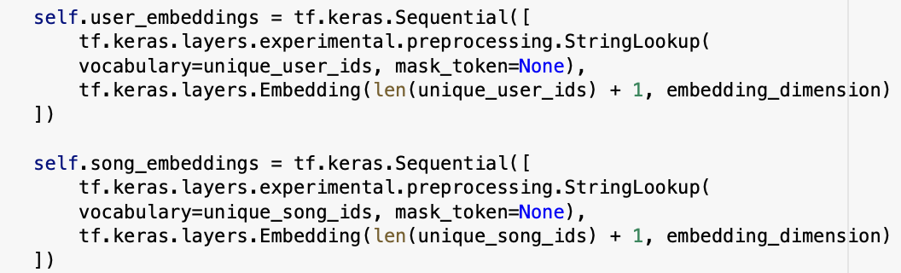

These towers are constructed, first by using the keras preprocessing framework to turn our vocabulary into integer slices, and then mapping them to learned embedding vectors.

After doing this process for both user and song id, we can set up the layers for our neural network:

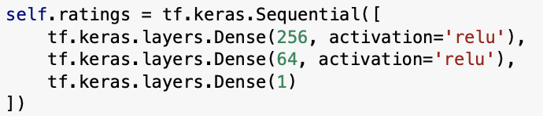

Many approaches can be taken when choosing layers for our models. For this approach, we decided to use a simple model with only three dense layers using relu activation. While we could add more layers to learn more latent information, this often leads to overfitting of the data. Thus, we decided a simpler model would lead to better generalization.

Finally, it's time to train the data. In this step, we had two main parameters to optimize the model on: learning rate and epochs. The learning rate of a model is a parameter that dictates how much to adjust the model in response to the error each time the model weights are updated. Epochs are the number of times the model runs on the entire training set.

To optimize these values, we ran a cross validation algorithm to find optimal values of learning rate and epochs. Through this process, we learned two major things:

As expected, a high number of epochs results in a very low training MSE. Unfortunately, after a certain number of epochs, there is a negative effect on validation MSE, and results in the model heavily overfitting to the training data. Thus, we learned that 6 epochs is the optimal number that minimizes MSE but prevents overfitting the data.

Typically, the lower the learning rate, the lower we could expect MSE to become, as smaller changes in the model allows for more learning to take place. This however, requires more epochs. From the results of the cross validation, we learned that a low learning rate and high number of epochs was not having an optimal effect on minimizing the MSE, and so decided on the following values for our parameters:

Epochs: 6

Learning Rate: 0.3

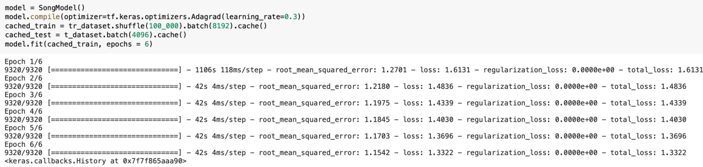

**Section 4**

Our dataset consists of ratings that Yahoo Music users have given to songs and anonymized song, album, artist, and genre metadata. This dataset is hosted on Yahoo's research database and is part of the Webscope Program in which the data may only be used for academic research purposes under a signed Data Sharing agreement and not for commercial use. This dataset was applied in a research paper by CMU called "Asking Questions and Developing Trust", this dataset was used with a Netflix and product dataset to compare the error rates for combined and domain specific algorithms. The recommendation system used collaborative filtering and used the 20 main genres of music in the data as the categories in domain-specific systems. Using an ANOVA on the MSES of both systems, it was found that both algorithms provided accurate predictions, however a user dependent selection algorithm would be the best system for a user. A similar Yahoo Music dataset containing over a million ratings of musical artists over the course of a one month period, was used in a published Github API to recommend new artists to a particular user. This project used user-based collaborative filtering to recommend new artists to a user. Their model found similar users using the Pearson Correlation similarity function and the euclidean distance as their accuracy metric to execute the recommendations. Another similar dataset that was used in the paper 'Rating music: Accounting for rating preferences' explored a survey on Yahoo's users probability on rating a song based on their preference for it. Using a behavioral model based on an empirical likelihood function, the paper suggested that users are more likely to rate songs that they either love or hate or have a particularly strong preference on. This result is insightful to our own model as when we are trying to predict ratings, if a user doesn't have enough previous ratings to apply collaborative filtering on, the default metric could be assigning a very low or high rating depending on the song content instead of a mid rating. When particularly developing recommendations for music related data, there are many baseline models and methods used for them. Music recommendations differ from other domains in many ways. For example, the penalty cost of a wrong or negative recommendation is not as high since the duration of tracks are very short and the high number of tracks commercially available make music seem disposable. For music content based features are very important as audio signals, patterns, and beats make a big difference in finding similarity between songs. As a result, deep learning approaches using markov embeddings can be used for automatic feature learning from audio signals and state of the art emotion recognition models can match the user's mood while listening. Finally, repetition and sequential information is also valued in music as users are more likely to listen to songs they like over and over again or could listen to playlists and sessions with order in the songs. Recurrent neural networks are used to leverage this sequential information and vectors of probabilities can be used to repeat recommendations as well. Streaming platforms such as Pandora, Spotify, Apple Music all use combinations of these models, features, and different techniques from content based to similarity based recommendations to optimize their listeners' experiences. Some findings such as users having a higher probability of rating a 1 or 5 over mid level ratings align with our rating counts as well. In addition to that, our analysis found low correlations between the genre and rating and in music recommendation research, papers have emphasized the importance of audio features and song based similarity in recommendations, showing that metadata of a song may not be as significant of a feature.

**Section 5**

After parameter selection, we trained the model on our full training set of 76 million entries.

After training using these parameters, we achieved the following validation MSE

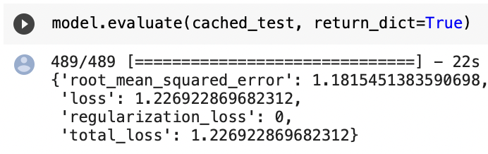

Using this model, we can generate predictions for a specific user, given a specific song using the following code:

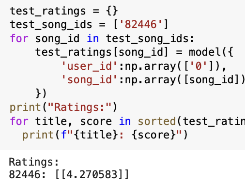

We see that our predictor is close to the actual rating of song 82446, user 0, returning a rating of 4.2, compared to an actual rating of 5.

Let's compare our model with the results from the baseline latent factor model:

With a validation MSE of 1.75, we see that our deep learning model outperforms the basic latent factor model by approximately 0.53, indicating that a deep learning approach may be beneficial when building recommendation systems. Our results, however, may not be fully conclusive because of two major factors:

1. For our baseline, we created a basic latent factor model. A more effective choice of latent factor model would be of the following form:

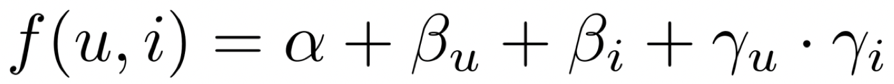

Where, Gamma(u) are the user's preferences and Gamma(i) are the song's attributes.

This is a much more robust choice of model when creating latent factor models, and would most likely yield a much better result than the simple baseline we used in this project. Because of this, we can't conclusively say that our deep learning framework is more effective than a latent variable approach for this problem.

1. Another issue was that the training set we used was simply too big to run on our latent factor model. 76 million entries was unfortunately too much data and was too time consuming to effectively run a training algorithm on. Because of this, we had to use a simplified training and testing set, using around 8 million entries for training and 2 million entries for testing. It's obvious in this case that the deep learning approach has substantially more data than our baseline. Thus, we don't know for sure whether the deep learning approach is performing better due to its architecture, or simply because it has access to so much more data in the training set.

With both models built, we can generate predictions and compare them to visualize the effectiveness of both approaches compared to the actual rating:

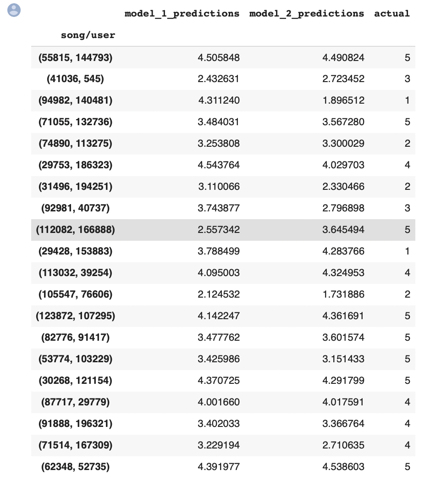

**References**

**Julian McAuley. "Web Mining and Recommendation Systems." Lectures 3,4,5**

**Kula, Maicej, and James Chen. "Introducing Tensorflow Recommenders."** _ **The TensorFlow Blog** _ **, 23 Sept. 2020, https://blog.tensorflow.org/2020/09/introducing-tensorflow-recommenders.html.**

**Schedl, Markus. "Deep Learning in Music Recommendation Systems."** _ **Frontiers** _ **, Frontiers, 1 Jan. 1AD, https://www.frontiersin.org/articles/10.3389/fams.2019.00044/full#B11.**
